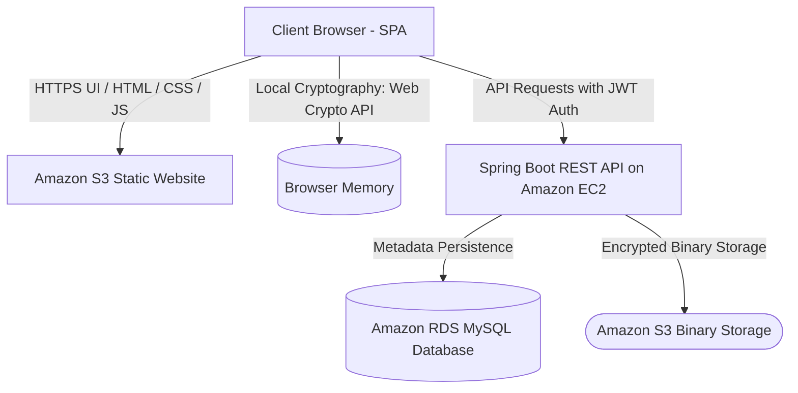

# SecureCrypt-Cloud-File-Encryption: Cloud-Based Zero-Knowledge File Encryption Platform

SecureCrypt is a professional, cloud-based file encryption platform that enables users to securely encrypt and decrypt files locally in their browser using strong cryptographic algorithms. Under its zero-knowledge design scheme, raw passwords and decryption keys never leave the client browser. Encrypted file binary blocks (GZIP compressed, AES-256-GCM encrypted) are stored in AWS S3, and metadata is persisted in an AWS RDS MySQL database.

---

## 🔒 Security Model (Zero-Knowledge)
- **Local Client Processing**: All compression, key derivation, encryption, and decryption happen locally in the browser memory using the Web Cryptography API (`crypto.subtle`).
- **Data Protection**: The server only receives encrypted binary files (`.scf`) and metadata. It has zero knowledge of the raw password or file content, preventing data breaches even if the server is compromised.
- **Form-Data Streaming**: Payload transfers to AWS S3 are handled via authenticated multi-part streams.

---

## 🚀 Features
- **User Authentication**: Secure token-based authentication using JSON Web Tokens (JWT).
- **AES File Encryption**: Fast local file compression (GZIP) and encryption using AES-256-GCM.
- **Secure File Decryption**: Locally decodes `.scf` archives, verifying magic bytes, salt, and integrity tags.
- **1-Click Cloud Decrypt**: Streams files directly from AWS S3 storage into browser memory for decrypt processing.
- **Cloud File Deletion**: Real-time CRUD action to prune S3 objects and database metadata simultaneously.
- **Responsive Dark Theme UI**: Premium aesthetic using a vibrant dark-purple/neon-cyan color palette.

---

## 🛠️ Technology Stack
- **Backend**: Java 21, Spring Boot 3.2.2, Spring Security, Spring Data JPA, JWT (io.jsonwebtoken)
- **Database**: Amazon RDS MySQL, H2 In-Memory Database (for local test environment)
- **Storage**: Amazon S3 (Binary blob storage)
- **Frontend**: Vanilla HTML5, CSS3, Modern ES6 JavaScript (using Web Crypto APIs)
- **Build Tool**: Maven 3.9.6

---

## 📐 Architecture Diagram



---

## 📸 Screenshots

To populate your repository portfolio:
1. Capture screenshots of your running app and place them inside the `frontend/assets/screenshots/` directory.
2. Ensure they are named as follows:
   - **Login Screen**: `login-page.png`
   - **Dashboard**: `home-page.png`
   - **Encrypt View**: `encrypt-page.png`
   - **Decrypt View**: `decrypt-page.png`

---

## ⚙️ Installation & Local Setup

### Prerequisites
- **Java Development Kit (JDK 21)**
- **Node.js** (for running the frontend static server locally)
- **MySQL Database Server** (running locally on port 3306)

### 1. Set Up Database
Initialize your local database server (e.g. MySQL) and create a schema named `securecrypt`:
```sql
CREATE DATABASE securecrypt;
```

### 2. Configure Properties
Go to `backend/src/main/resources/` and copy the template:
```bash
cp application-example.properties application.properties
```
Edit `application.properties` with your local database username, password, and S3 credentials (or keep S3 disabled to use local directory storage).

### 3. Run Backend API
Navigate to the `backend/` directory and compile/run the Spring Boot application:
```bash
mvn clean package
java -jar target/securecrypt-platform-1.0-SNAPSHOT.jar
```
*Note: The API server will boot on port `8080`.*

### 4. Run Frontend Server
Navigate to the root directory and start the static web server:
```bash
node scratch/server.js
```
*Open your browser and navigate to **http://localhost:3000**.*

---

## 🔌 API Reference

### User Authentication
| Method | Endpoint | Description | Auth Required |
| :--- | :--- | :--- | :--- |
| `POST` | `/api/auth/register` | Register a new user | No |
| `POST` | `/api/auth/login` | Login and receive JWT token | No |

### Storage & Files
| Method | Endpoint | Description | Auth Required |
| :--- | :--- | :--- | :--- |
| `POST` | `/api/files/upload` | Upload encrypted file binary and metadata | Yes (Bearer Token) |
| `GET` | `/api/files/list-metadata` | List current user's file records | Yes (Bearer Token) |
| `GET` | `/api/files/download/{id}` | Retrieve and stream file binary from storage | Yes (Bearer Token) |
| `DELETE` | `/api/files/delete/{id}` | Permanently delete file from S3 and database | Yes (Bearer Token) |